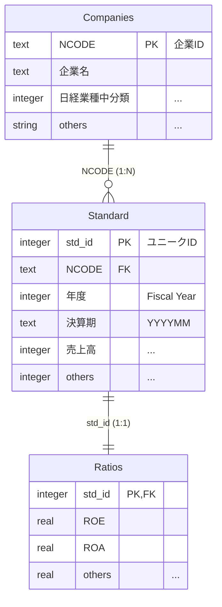

# Standard Database Schema (`standard_schema.md`)

`standard.db` は、企業の財務データを正規化して格納した SQLite データベースです。
以下の 3 つのテーブルと 1 つのビューで構成されています。

## ER 図（概念）



---

## テーブル定義

### 1. Companies (企業マスタ)

企業属性に関するマスタテーブルです。`NCODE` が主キーとなります。

| カラム名 | 型 | 説明 |
| --- | --- | --- |
| **NCODE** | TEXT | **[PK]** 日経会社コードの先頭に "N" を付した一意の識別子 |
| 日経会社コード | INTEGER | 日経会社コード |
| 企業名 | TEXT | 企業名 |
| 日経業種小分類 | INTEGER | 日経業種コード（小分類） |
| 日経業種小分類名 | TEXT | 日経業種名（小分類） |
| 日経業種中分類 | INTEGER | 日経業種コード（中分類） |
| 日経業種中分類名 | TEXT | 日経業種名（中分類） |

### 2. Standard (財務データ)

財務諸表（BS/PL/CF）およびその他の主要項目を格納するテーブルです。`std_id` が主キーです。
※各項目の詳細な定義は、後述の「勘定科目一覧」を参照してください。

| カラム名 | 型 | 説明 |
| --- | --- | --- |
| **std_id** | INTEGER | **[PK]** レコード固有の連番ID |
| NCODE | TEXT | **[FK]** 企業ID (Companiesテーブル参照) |
| 決算期 | TEXT | 決算年月 (YYYYMM) |
| 年度 | INTEGER | 会計年度 (Fiscal Year) ※5月決算以前は前年扱い |
| 証券コード | TEXT | 証券コード |
| 決算月数 | INTEGER | 決算対象期間の月数 (通常は12) |
| (BS項目) | INTEGER | 流動資産, 総資産, 利益剰余金 など |
| (PL項目) | INTEGER | 売上高, 営業利益, 当期純利益 など |
| (CF項目) | INTEGER | 営業CF, 投資CF, 財務CF など |
| (その他) | INTEGER | 設備投資額, 従業員数 など |

### 3. Ratios (財務指標)

`Standard` テーブルのデータをもとに計算された財務指標です。`Standard` と 1対1 で対応します。

| カラム名 | 型 | 計算式・説明 |
| --- | --- | --- |
| **std_id** | INTEGER | **[PK, FK]** Standardテーブルと結合 |
| ROA | REAL | 営業利益 / 前期末総資産 |
| ROE | REAL | 当期純利益 / (前期末総資産 - 前期末総負債) |
| ATO | REAL | 売上高 / 前期末総資産 (総資産回転率) |
| PM | REAL | 営業利益 / 売上高 (売上高営業利益率) |
| 流動比率 | REAL | 流動資産 / 流動負債 |
| 当座比率 | REAL | (現金預金 + 売上債権 + 有価証券) / 流動負債 |
| 自己資本比率 | REAL | (総資産 - 総負債) / 総資産 |
| 有利子負債依存率 | REAL | (借入金 + 社債 + リース債務) / 総資産 |
| 総資本留保利益率 | REAL | 利益剰余金 / 総資産 |
| ICR | REAL | 営業利益 / 支払利息 (インタレスト・カバレッジ・レシオ) |
| 経常収支比率 | REAL | 経常的収入 / (経常的収入 - 営業CF) |
| CICR | REAL | -1 * 営業CF / 利息支払額 |
| 有利子負債返済年数 | REAL | 有利子負債 / 営業CF |

### 4. view_primary (主要データビュー)

分析によく利用される主要項目を `Companies`, `Standard`, `Ratios` から結合し、`決算月数 = 12` のデータのみに絞り込んだビューです。

* **結合条件**: `Standard` をベースに `Companies` (NCODE) と `Ratios` (std_id) を左外部結合
* **フィルタ**: `WHERE 決算月数 = 12`

具体的には以下のクエリで作成されています。

```sql
CREATE VIEW view_primary AS
SELECT
    s.NCODE,
    s.年度,
    c.企業名,
    s.証券コード,
    c.日経業種中分類名,
    c.日経業種小分類名,
    s.総資産,
    s.売上高,
    s.営業利益,
    s.当期純利益,
    r.ROA,
    r.ROE,
    r.ATO,
    r.PM,
    r.流動比率,
    r.当座比率,
    r.自己資本比率,
    r.有利子負債依存率,
    r.総資本留保利益率,
    r.ICR,
    r.経常収支比率,
    r.CICR,
    r.有利子負債返済年数,
    s.std_id,
    s.決算期
FROM Standard s
LEFT JOIN Companies c ON s.NCODE = c.NCODE
LEFT JOIN Ratios r ON s.std_id = r.std_id
WHERE s.決算月数 = 12
ORDER BY s.NCODE, s.決算期;

```

---

## 勘定科目一覧 (Standard テーブル詳細)

### 1. 貸借対照表 (BS)

| 抽出名 | 項目コード | 項目名 | 備考 |
| :--- | :--- | :--- | :--- |
| 流動資産 | B01021 | 流動資産 | 流動資産合計。 |
| 流動負債 | C01021 | 流動負債 | 流動負債合計。 |
| 棚卸資産 | B01034 | 棚卸資産 | 棚卸資産の合計額。販売用不動産・未成工事支出金を含む。 |
| 現金預金 | B01022 | 現金・預金 | 現金および預金。ただし、1 年内に期限の到来しない預金等を除く。 |
| 売上債権 | B01023 | 受取手形・売掛金 | 受取手形・売掛金。B01024(受取手形), B01025(売掛金) の合計金額。 |
| 売買目的有価証券 | B01033 | 有価証券 | 売買目的有価証券および一年内に満期の到来する有価証券。 |
| 有形固定資産 | B01063 | 有形固定資産 | 有形固定資産合計。 |
| 無形固定資産 | B01076 | 無形固定資産 | 無形固定資産合計。 |
| 仕入債務 | C01022 | 支払手形・買掛金 | 支払手形・買掛金。C01023(支払手形), C01024(買掛金) の合計金額。 |
| 短期借入金等 | C01026 | 短期借入金・社債合計 | 短期借入金・社債合計。C01027(１年内返済の借入金), C01032(１年内償還の社債・転換社債) の合計金額。 |
| 長期借入金等 | C01058 | 長期借入金・社債・転換社債 | 長期借入金・社債・転換社債。C01059(社債・転換社債), C01062(長期借入金) の合計金額。 |
| 短期リース債務 | C01035 | リース債務 | 流動負債に属するリース債務。リース未払金を含む。流動・非流動区分なしの貸借対照表で開示された「リース債権」はここに収録。 |
| 長期リース債務 | C01064 | リース債務 | 非流動負債に属するリース債務。リース未払金を含む。 |
| 総資産 | B01110 | 資産合計 | 資産合計。B01021(流動資産), B01062(固定資産), B01104(繰延資産) の合計金額。 |
| 総負債 | C01082 | 負債合計 | 負債合計。C01021(流動負債), C01057(固定負債), C01078(特別法上の準備金・引当金) の合計金額。 |
| 利益剰余金 | C01092 | 利益剰余金 | 損益取引から生じた剰余金。利益準備金、任意積立金、および当期未処分利益など。2003 年 2 月までは「連結剰余金」を収録。 |

### 2. 損益計算書 (PL)

| 抽出名 | 項目コード | 項目名 | 備考 |
| :--- | :--- | :--- | :--- |
| 売上高 | D01021 | 売上高・営業収益［累計］ | 商品売上高、製品売上高、完成工事高、輸送 (海運、鉄道など)、倉庫、放送、電力・ガス、興行 (映画、ホテルなど) 等のサービス会社での営業収入、信販・証券金融・証券代行・商品先物などの営業収益。|
| 売上原価 | D01024 | 売上原価・営業原価［累計］ | 売上高に対応する売上原価・営業原価および役務収益の原価。リース会社でのリース原価。 |
| 販管費 | D01027 | 販売費及び一般管理費［累計］ | 商品や製品を販売するための費用や一般管理業務にかかる費用。 |
| 支払利息 | D01047 | 支払利息・割引料［累計］ | 金融機関からの長期・短期の借入金利子、金融機関以外からの借入にかかる利息、手形の割引料、社債利息などの金融費用。 |
| 営業利益 | D01029 | 営業利益［累計］ | 営業利益。D01021(売上高・営業収益［累計］)-D01023(営業費用［累計］) |
| 当期純利益 | D01110 | 親会社株主に帰属する当期純利益／当期利益［累計］ | 連結決算：親会社株主に帰属する当期純利益（2015年 4月 1日以後を期首日とする決算より。それ以前は「当期利益」）。単独決算：当期利益。 |

### 3. キャッシュ・フロー計算書 (CF)

| 抽出名 | 項目コード | 項目名 | 備考 |
| :--- | :--- | :--- | :--- |
| 営業活動によるキャッシュフロー | F01065 | 営業活動によるキャッシュフロー | 営業活動によるキャッシュフロー。F01059(小計), F01060(利息及び配当金の受取額), F01061(利息の支払額), F01062(法人税等の支払額), F01063(災害による保険金収入), F01064(損害賠償金の支払額) の合計金額。 |
| 売上債権減少額 | F01046 | 売上債権の減少額（▲増） | 売上債権の増減額を調整するための項目。 |
| 小計 | F01059 | 小計 | 間接法の場合：F01021(税金等調整前当期純利益) から F01054(貸付金の増減額（▲増）), F01136(負ののれん発生益) の合計。直接法の場合：F01055(営業収入) + F01056(原材料・商品仕入支出（▲）) + F01057(人件費支出（▲）) + F01058(その他の営業支出（▲）) |
| 利息及び配当金の受取額 | COALESCE(F01060, F01085) | 利息及び配当金の受取額 | 利息及び配当金の受取額の総額。|
| 利息の支払額 | COALESCE(F01061, F01011) | 利息の支払額（▲） | 利息の支払額の総額。|
| 法人税等の支払額 | F01062 | 法人税等の支払額（▲） | 法人税等の支払額の総額。 |
| 投資活動によるキャッシュフロー | F01087 | 投資活動によるキャッシュフロー | 投資活動によるキャッシュフロー。F01067(定期預金の預入による支出（▲）)～F01086(その他の投資活動によるキャッシュフロー) の合計。 |
| 財務活動によるキャッシュフロー | F01106 | 財務活動によるキャッシュフロー | 財務活動によるキャッシュフロー。F01089(短期借入金の純増減（▲減）)～F01105(その他の財務活動によるキャッシュフロー) の合計金額。 |

### 4. その他の項目

| 抽出名 | 項目コード | 項目名 | 備考 |
| :--- | :--- | :--- | :--- |
| 海外売上高 | H01016 | 海外・輸出売上高［累計］ | 事業年度もしくは年度の期首から四半期会計期間の海外売上高。 |
| 研究開発費 | H01033 | 研究開発費 | 「研究開発活動の状況」欄に記載された研究開発投資額。 |
| 設備投資額 | H01034 | 設備投資額 | 「設備の状況」欄に記載された設備投資額。 |
| 期末従業員数 | H01021 | 期末従業員数 | 期末従業員数。 |
| 平均臨時従業員数 | H01170 | 平均臨時従業員数。 | 平均臨時従業員数。2010 年 3 月期から収録。 |

### 5. 共通項目その他

| 抽出名 | 項目コード | 項目名 | 備考 |
| :--- | :--- | :--- | :--- |
| 年度 | - | - | Compustat 基準に準拠して計算された会計年度 (Fiscal Year)。決算月が1〜5月の場合、暦年 - 1 を年度とする(例: 2020年3月決算 → 2019年度)。6〜12月は暦年通り。 |
|日経会社コード| NKCODE | 日経会社コード | 日経が定める会社コード |
| NCODE | - | - | 日経会社コードの先頭に "N" を付したコード |
| 決算期 | ACC | 決算期 | YYYYMM の 6 ケタ整数で表示された決算期 |
| 決算月数 | MACC | 決算月数 | 会計期間に含まれる月数。この値が 12 以外の値をとるデータは drop することを推奨。 |
| 証券コード | STKNO | 株式コード(固有名コード) | 証券コード協議会が設定する銘柄コードのうち、4桁の固有体コード。|
| 日経業種小分類 | NKILS | 日経業種小分類 | 日経の定める業種コード。小分類(3桁)。|
| 日経業種小分類名 | NKILS | 日経業種名(漢字) | 日経業種名(漢字)。小分類に対応。|
| 日経業種中分類 | NKILM | 日経業種中分類 | 日経の定める業種コード。中分類(2桁)。|
| 日経業種中分類名 | - | - | 日経中分類に対応する日本語名を凡例から入手し記録。 |

`standard.R` の処理ロジック に基づき、`replace_na` 関数で明示的に 0 置換されている項目のみを抽出しました。

ドキュメントの末尾、または「テーブル定義」と「勘定科目一覧」の間に追記する想定の Markdown テキストです。

---

## データの加工・補完について

### 特定の科目の欠損値（NA）に係る扱い

Ratios テーブルについて、以下のデータは、元データが存在しない（`NA`）場合、値が「0」であるとみなして各種の財務指標 (当座比率や有利子負債依存率など) を計算しています (Standard テーブル上は `NA` のまま格納されています)。

* **BS（貸借対照表）項目**
    * 売上債権
    * 売買目的有価証券
    * 短期借入金等
    * 長期借入金等
    * 短期リース債務
    * 長期リース債務

* **CF（キャッシュフロー計算書）項目**
    * 売上債権減少額
    * 利息及び配当金の受取額
